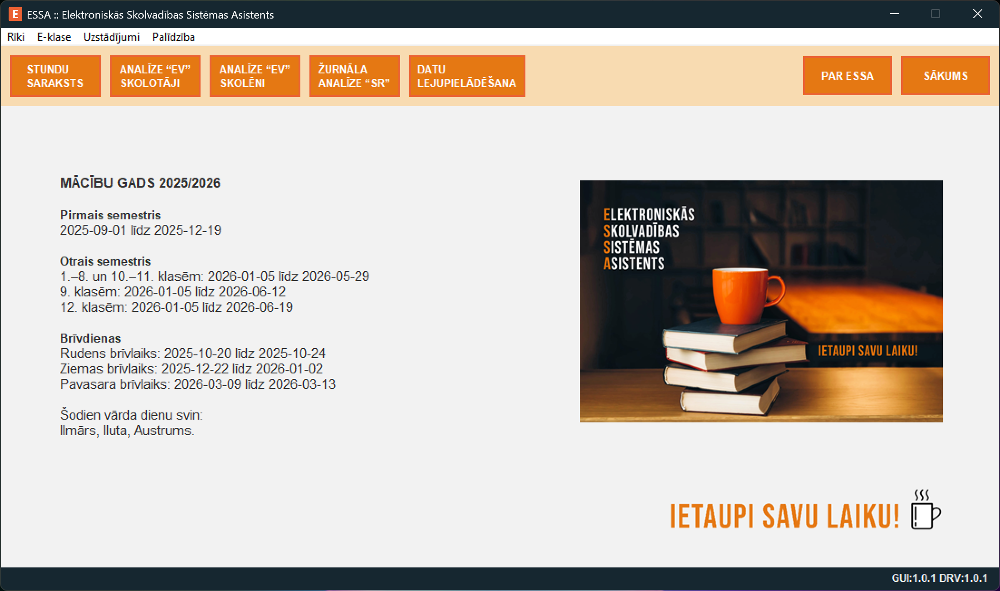

<p align="center">
    
</p>

# Elektroniskās Skolvadības Sistēmas Asistents

 

> Programmas lietošanas instrukcija ir atrodama [docs](https://github.com/mariuszduka/ESSA/tree/main/docs) mapē.

## Saturs

- [Programmas funkcionalitāte](#programmas-funkcionalitāte)
- [Programmas lietošana](#programmas-lietošana)
- [Kā lejupielādēt un palaist programmu?](#kā-lejupielādēt-un-palaist-programmu)
- [Kontakti](#kontakti)
- [Licence](#licence)

## Programmas funkcionalitāte

### Stundu saraksta izgūšana

Izmantojot ESSA, var ātri un ērti izgūt stundu sarakstu izvēlētajām klasēm no skolvadības sistēmas. Programma piedāvā arī iespēju pievienot stundu laikus, skolotājus un fakultatīvās un interešu izglītības nodarbības.

### Detalizēta vērtējumu analīze

Izmantojot ESSA, var ātri un ērti izgūt pārskatāmus kopsavilkumus par skolotāju izliktajiem vērtējumiem, kā arī izgūt datus par skolēnu mācību sasniegumu vērtējumiem.

### Mācību stundu tēmu analīze

Programma palīdz pārbaudīt, vai mācību stundu ieraksti elektroniskajā žurnālā atbilst noteiktajiem standartiem. ESSA analizē tēmu saturu un izceļ tās, kurās trūkst nepieciešamo frāžu, piemēram, "Sasniedzamie rezultāti".

### Datu lejupielāde no digitālajām platformām

ESSA ļauj lejupielādēt datus no digitālajām izglītības platformām, piemēram, stundu sarakstus un elektroniskos žurnālus. Dati tiek šifrēti, lai nodrošinātu to drošību.

### E-klase.lv

[E-klase](https://www.e-klase.lv) ir visplašāk lietotā tiešsaistes skolvadības sistēma Latvijā, kuru izmanto vairāk kā 90% Latvijas izglītības iestāžu. ESSA ļauj lejupielādēt datus no E-klase, lai analizētu stundu sarakstus un vērtējumus.

## Programmas lietošana

<p align="center">
    
</p>

> Programmas lietošanas instrukcija ir atrodama [docs](https://github.com/mariuszduka/ESSA/tree/main/docs) mapē.

### Programmas uzsākšana

Pēc programmas palaišanas parādīsies informācija par apstiprinātiem mācību gada sākuma, beigu un brīvdienu laikiem.

Logā var izvēlēties šādas funkcijas:
- Stundu saraksta veidošana
- Informācija par vērtēšanu → Skolotāji
- Informācija par vērtēšanu → Skolēni
- Informācija par mācību stundu tēmām
- Datu lejupielādēšana no digitālās izglītības platformas

### Autorizācija elektroniskās skolvadības sistēmās

Lai lejupielādētu datus no elektroniskās skolvadības sistēmas ir jābūt autorizētai darbinieka piekļuvei. Datu analīzes apjoms ir atkarīgs no piešķirtajām tiesībām.

> Drošības dēļ, tavi piekļuves dati (lietotājvārds un parole) nekur netiek saglabāti. Ja izmanto SQLCipher bibliotēku, visi izgūtie dati ir šifrēti, kas neļauj tos nolasīt neautorizētām personām.

### Datu izgūšana no elektroniskās skolvadības sistēmas

Pēc pieslēgšanās sistēmai tu redzēsi klašu sarakstu, no kura varēsi izgūt stundu sarakstu un datus no elektroniskā žurnāla.

Kalendārā iestati datumu, no kura jāizgūst stundu saraksts. Ieteicams izgūt datus sākot ar nākamo pirmdienu, tādējādi tu vari būt pārliecināts, ka dati ir aktuāli.

Datu žurnāls tiek izgūts visam semestrim, visiem priekšmetiem.

> Žurnāla datu izgūšana var aizņemt līdz pat vairākām minūtēm! Tāpēc labāk izvēlies tikai vajadzīgās klases.

### Informācija par pēdējo datu izgūšanu no sistēmas

Programma informē par pēdējo datu atjaunošanas datumu datubāzē, kas atvieglo lēmuma pieņemšanu par to, vai dati ir jāatjaunina.

Datu izgūšanas mehānisms ir veidots tā, lai netraucētu normālu elektroniskās skolvadības sistēmas darbību, tas nozīmē, ka datu izgūšana var aizņemt līdz pat vairākām minūtēm.

> Nav nepieciešams lejupielādēt datus katru reizi, kad izmanto programmu. Visi izgūtie dati tiek glabāti datubāzē. Datus var lejupielādēt, kad ir zināms, ka tie noteikti ir mainījušies.

### Stundu saraksta veidošana

Balstoties uz elektroniskajā skolvadības sistēmā esošajiem datiem, var izveidot stundu sarakstu izvēlētajām klasēm, kā arī izveidot mācību telpu noslogojuma plānu konkrētai dienai.

Stundu sarakstā ir iespēja iekļaut mācību stundas, fakultatīvās un interešu izglītības nodarbības, kā arī pagarinātās dienas grupas nodarbības.

> Papildu konfigurāciju stundu saraksta izveidei, piemēram, stundu laiku maiņu, skolotāju pievienošanu vai citu parametru pielāgošanu, var veikt programmas iestatījumos.

### Informācija par vērtēšanu → Skolotāji

Detalizēta visu mācību stundu analīze, sadalot pēc skolotājiem, klasēm un priekšmetiem.

Tabulā ir norādīti šādi dati:
- `PD(%)` - pārbaudes darba svars procentos,
- `V(max)` - skolēnu skaits,
- `V(b)` - piešķirto vērtējumu skaits pārbaudes darbos,
- `V(%)`, `V(stap)` - piešķirto vērtējumu skaits kā %, STAP
- `V(i)`, `V(ni)`, `V(nv)`, `V(n)`, `V(vam)` - skaits "i", "ni", "nv", "n", VAM,
- `Tēma` - mācību stundas tēma.

Ar krāsu ir atzīmēti pārbaudes darbi, kuros vērtējumi nav piešķirti visiem skolēniem. Datus var grupēt un kārtot, kā arī eksportēt uz Excel failu.

### Informācija par vērtēšanu → Skolēni

Detalizēta datu analīze par klasēm un skolēniem.

Tabulā ir norādīti šādi dati:
- `n`, `nv`, `i`, `ni` - saņemto "n", "nv", "i", "ni" skaits,
- `nv(PD)` - saņemto "nv" skaits pārbaudes darbos,
- `1-10` - visu saņemto vērtējumu vidējais,
- `%` - visu saņemto vērtējumu vidējais procentos,
- `1`,`2`,...,`9`,`10`, `S`,`T`,`A`,`P`, `VAM` - saņemto vērtējumu skaits.

Ar citu krāsu ir atzīmēti skolēni, kuriem ir `nv` pārbaudes darbā. Datus var grupēt un kārtot, kā arī eksportēt uz Excel failu.

### Informācija par mācību stundu tēmām

Šī analīze palīdz nodrošināt, ka mācību stundu tēmas ir pilnībā aprakstītas un atbilst noteiktajiem standartiem.

Tiek analizēta šādu frāžu esamība stundas tēmā:
- SR, S.R
- Sasniedzamie rezultāti
- Sasniedzamais rezultāts

Ar citu krāsu ir atzīmēti ieraksti, kuros nav iekļauti nepieciešamie izteicieni. Datus var grupēt un kārtot, kā arī eksportēt uz Excel failu.

### Programmas uzstādījumi

Programma ļauj skolām personalizēt eksportēto stundu sarakstu Excel formātā.

- Var definēt savu stundu saraksta nosaukumu.
- Iespēja pielāgot dienu nosaukumus, stundu sākuma un beigu laikus.
- Programma automātiski optimizē skolotāju vārdus un uzvārdus, kā arī priekšmetu nosaukumus.

> Visas konfigurācijas izmaiņas jāveic ļoti uzmanīgi.

## Kā lejupielādēt un palaist programmu?

> **Programmu ESSA var lejupielādēt un lietot bez maksas.**

### 1. iespēja → ja vēlies izmantot pirmkodu

Lai palaistu programmu, ir nepieciešams [Python](https://www.python.org/downloads/) interpretators un [GIT](https://git-scm.com/downloads).

Izpildi šādas komandas:

```
git clone https://github.com/mariuszduka/essa.git
cd essa
pip install -r requirements.txt
```

> Ja vēlies šifrēt informāciju SQL datubāzē, ir jāinstalē [SQLCipher](https://github.com/coleifer/sqlcipher3) bibliotēku. Lūdzu, izlasi šo [dokumentāciju](https://github.com/silverback97/pysqlcipher3-for-windows), ja izmanto operētājsistēmu Windows.

Tagad var palaist programmu:

```
cd app
python start.py
```

### 2. iespēja → ja vēlies palaist īpašu versiju operētājsistēmai Windows

- [Lejupielādē ZIP failu](https://github.com/mariuszduka/ESSA/releases/) ar ESSA programmu un izpako to.
- Atver mapi un palaid failu ESSA.exe.

> Vienkārši lejupielādē failu, izpako to un palaid programmu!

## Kontakti

Mariusz Duka<br>[www.duka.lv](https://duka.lv)

Droši raksti man, ja Tev ir kādi jautājumi par programmas lietošanu.

## Licence

Copyright (C) 2025 Mariusz Duka<br>
This project is licensed under GNU GPL v3 or later.<br>
See the `LICENSE` file for full text.